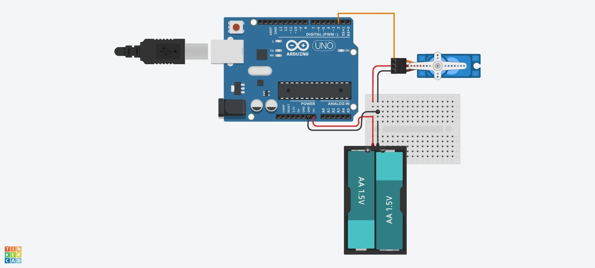

# Project: Servo Sweep

A simple Arduino project demonstrating smooth servo motor motion control using the built-in Servo library. 

# License
This project is licensed under the MIT License.

#  Features:

Smooth bidirectional sweep between 0° and 180°. 
Adjustable speed and step size for motion tuning. 
Compact, beginner-friendly code ready for any servo-based experiment. 

#  Hardware Required:

Arduino Uno (or compatible board) 
Servo motor (e.g., SG90 or MG90S) 
Jumper wires 
External power (recommended ) 

#  Connections
<table>
<tr>
 <th>Component</th>
  <th>Arduino Pin</th>
</tr>
<tr>
 <td>Servo Signal</td> 	
  <td>D2</td>
</tr>
<tr>
  <td>Servo VCC	</td>
  <td>5V</td>
</tr>
<tr>
  <td>Servo GND</td>
  <td>GND</td>
</tr>
</table>

#  How It Works

The code uses the built-in Servo library to control servo angles. 
Servo myServo; creates a servo object. 
myServo.attach(2); connects the servo’s signal wire to pin 2. 
The first for loop rotates the servo from 0° → 180°. 
The second for loop brings it back from 180° → 0°. 

You can adjust: 
delay(2); → speed (smaller value = faster movement). 
pos += 1; or pos -= 1; → movement step size (bigger step = faster but less smooth). 

# How to Use (Step-by-Step Procedure)

<b> 1. Install the Arduino IDE</b> 
<li>Download from the official Arduino site.</li>
<li>Install it and open the IDE.</li> 

<b> 2. Set Up the Circuit</b> 
<li>Connect your servo motor to the Arduino as per the circuit diagram above.</li>
<li>If possible, use an external 5V power source to avoid brownout issues.</li> 

<b>3.Upload the Code</b> 
<li>Copy and paste the given code into a new Arduino sketch.</li>
<li>Go to Tools → Board → Arduino Uno (or your board).</li>
<li>Select the correct COM Port.</li>
<li>Click Upload.</li>
<li>Observe the Motion.</li>
<li>The servo will start sweeping smoothly between 0° and 180°.</li>
<li>If movement is jerky, increase the delay slightly (e.g., from 2 to 5 ms).</li>
<li>To make it faster, decrease the delay or increase the degree step size.</li>

# Example Use 

Use this project to test servo performance, calibrate angle limits, or integrate it into robotic arms, sensor mounts, or pan-tilt mechanisms.

